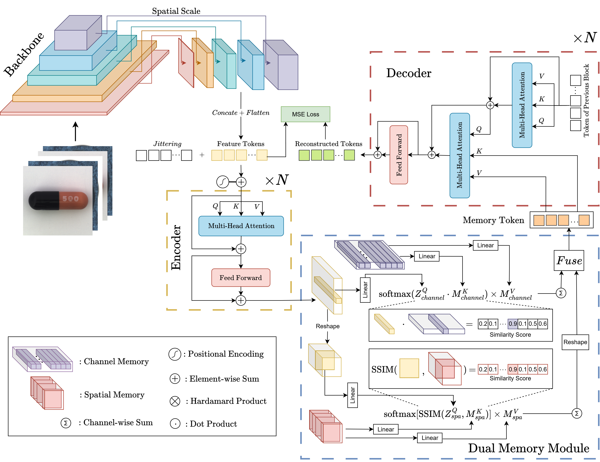

# DuMeNet: Dual-Memory based Reconstruction Method for Image Anomaly Detection

## Overview

Image anomaly detection (IAD) has emerged as a critical task in numerous real-world applications. Among existing techniques, reconstruction based approaches have shown promise; however, they often suffer from the identical shortcut problem, wherein both normal and anomalous regions are reconstructed with similar fidelity. This undermines the discriminative power of anomaly scores and limits detection performance. To address this limitation, we introduce DuMeNet, a novel dual-memory reconstruction network that incorporates two complementary memory mechanisms. Specifically, we proposed a spatial memory bank that utilizes the Structural Similarity Index Measure (SSIM) to emphasize spatial pattern reconstruction. On the MVTec-AD benchmark, DuMeNet achieves 98.5% image-level, 97.4% pixel-level AUROC, outperforming many baselines and has the best Out-of-Distribution detection performance on CIFAR-10. These results demonstrate the strong generalizability of DuMeNet and its practical utility in vision-field anomaly detection scenarios.

## Key Features

- **Dual Memory Architecture**: Dual memory architecture at channel-wise feature and spatial structural levels addressing the identical shortcut problem.
- **Transformer-based Reconstruction**: Leverages transformer encoder-decoder architecture for robust feature reconstruction
- **Spatial Attention Mechanism**: Utilizes SSIM similarity for preserving spatial patterns.
- **Continuous Query Mechanism**: Prevents the decoder from drifting away from memory-constrained representations by continuously referencing learned normal patterns

## Architecture



## MVTec-AD
- **Create the MVTec-AD dataset directory**. Download the MVTec-AD dataset from [here](https://www.mvtec.com/company/research/datasets/mvtec-ad). Unzip the file and move some to `./data/MVTec-AD/`. The MVTec-AD dataset directory should be as follows. 

```
|-- data
    |-- MVTec-AD
        |-- mvtec_anomaly_detection
        |-- json_vis_decoder
        |-- train.json
        |-- test.json
```

## Results

### MVTec-AD Dataset Results

DuMeNet achieves state-of-the-art performance on the MVTec-AD dataset:

| Category | US [28] |  | PSVDD [7] |  | PaDiM [10] |  | CutPaste [8] |  | MKD [29] |  | DRAEM [26] |  | UniAD [22] |  | Ours |  |
|----------|--------|-----|---------|-----|-----------|-----|------------|-----|---------|-----|-----------|-----|-----------|-----|------|-----|
|          | Image  | Pixel | Image   | Pixel | Image     | Pixel | Image      | Pixel | Image   | Pixel | Image     | Pixel | Image     | Pixel | Image | Pixel |
| Bottle   | 99.0   | 97.8 | 98.6    | 98.1 | 99.9      | 98.2 | 98.2       | -    | 99.4    | 96.3 | 99.2      | **99.1** | **100**    | 98.1 | **100** | 98.2 |
| Cable    | 86.2   | 91.9 | 90.3    | 96.8 | 92.7      | 96.7 | 81.2       | -    | 89.2    | 82.4 | 91.8      | 94.7 | 97.6      | 96.8 | **98.5** | **98.2** |
| Capsule  | 86.1   | 96.8 | 76.7    | 95.8 | 91.3      | **98.6** | 98.2       | -    | 80.5    | 95.9 | **98.5**    | 94.3 | 85.3      | 97.9 | 95.6 | **98.6** |
| Hazelnut | 93.1   | 98.2 | 92.0    | 97.5 | 92.0      | 98.1 | 98.3       | -    | 98.4    | 94.6 | **100**    | **99.7** | 99.9      | 98.8 | **100** | 98.1 |
| Metal Nut | 82.0  | 97.2 | 94.0    | 98.0 | 98.7      | 97.3 | 99.9       | -    | 73.6    | 86.4 | 98.7      | **99.5** | 99.0      | 95.7 | **100** | 95.3 |
| Pill     | 87.9   | 96.5 | 86.1    | 95.1 | 93.3      | 95.7 | 94.9       | -    | 82.7    | 89.6 | **98.9**   | **97.6** | 88.3      | 95.1 | 97.9 | 97.3 |
| Screw    | 54.9   | 97.4 | 81.3    | 95.7 | 85.8      | 98.4 | 88.7       | -    | 83.3    | 96.0 | 93.9      | 97.6 | 91.9      | 97.4 | **98.2** | **99.3** |
| Toothbrush | 95.3 | 97.9 | **100** | 98.1 | 96.1      | **98.8** | 99.4       | -    | 92.2    | 96.1 | **100**    | 98.1 | 95.0      | 97.8 | 98.8 | 98.5 |
| Transistor | 81.8 | 73.7 | 91.5    | 97.0 | 97.4      | 97.6 | 96.1       | -    | 85.6    | 76.5 | 93.1      | 90.9 | **100**    | 98.7 | 99.8 | **98.6** |
| Zipper   | 91.9   | 95.6 | 97.9    | 95.1 | 90.3      | 98.4 | 99.9       | -    | 93.2    | 93.9 | **100**    | **98.8** | 96.7      | 96.0 | 98.7 | 98.2 |
| Carpet   | 91.6   | 93.5 | 92.9    | 92.6 | 99.8      | **99.0** | 93.9       | -    | 79.3    | 95.6 | 97.0      | 95.5 | **99.9**  | 98.0 | 99.8 | 98.4 |
| Grid     | 81.0   | 89.9 | 94.6    | 96.2 | 96.7      | 97.1 | **100**    | -    | 78.0    | 91.8 | 99.9      | **99.7** | 98.5      | 94.6 | **99.9** | 98.0 |
| Leather  | 88.2   | 97.8 | 90.9    | 97.4 | **100**   | **99.0** | **100**    | -    | 95.1    | 98.1 | **100**    | 98.6 | **100**   | 98.3 | **100** | 98.9 |
| Tile     | 99.1   | 92.5 | 97.8    | 91.4 | 98.1      | 94.1 | 94.6       | -    | 91.6    | 82.8 | **99.6**   | **99.2** | 99.0      | 91.8 | **99.6** | 92.0 |
| Wood     | 97.7   | 92.1 | 96.5    | 90.8 | **99.2**  | 94.1 | 99.1       | -    | 94.3    | 84.8 | 99.1      | **96.4** | 97.9      | 93.4 | 98.5 | 93.0 |
| **Mean** | 87.7   | 93.9 | 92.1    | 95.7 | 95.5      | 97.4 | 96.1       | -    | 87.7    | 90.7 | 98.0      | 97.3 | 96.6      | 96.6 | **98.5** | **97.4** |

Compared to previous methods like DRAEM (96.6%, 96.6%), UniAD (97.6%, 97.4%), and others, DuMeNet consistently shows superior performance across most categories.

### CIFAR-10 Anomaly Detection Results

DuMeNet also performs exceptionally well on the CIFAR-10 dataset under the unified case:

| Normal Indices | US [28] | FCDD [30] | FCDD+OE [30] | PANDA [31] | MKD [29] | UniAD [22] | Ours |
|----------------|---------|-----------|--------------|------------|----------|------------|-------|
| {01234}        | 51.3    | 55.0      | 71.8         | 66.6       | 64.2     | 84.4       | **85.3** |
| {56789}        | 51.3    | 50.3      | 73.7         | 73.2       | 69.3     | 80.9       | **81.0** |
| {02468}        | 63.9    | 59.2      | 85.3         | 77.1       | 76.4     | 93.0       | **93.3** |
| {13579}        | 56.8    | 58.5      | 85.0         | 72.9       | 78.7     | **90.6**   | 90.4 |
| **Mean**       | 55.9    | 55.8      | 78.9         | 72.4       | 72.1     | 87.2       | **87.5** |

These results surpass previous methods including UniAD (87.2), MKD (72.1), PANDA (72.4), FCDD+OE (78.9), and US (55.9).

## Key Advantages

- **Robust to Noise**: The dual memory architecture enhances the model's robustness to noise in training data
- **Comprehensive Feature Extraction**: Multi-scale approach captures both local and long-term dependency information
- **Improved Memory Representation**: Dual memory-augmented encoder extracts both global typical patterns and local common features
- **Adaptive Memory**: Memory items are learned during training, allowing for better adaptation to different domains

## Requirements

- Python 3.8+
- PyTorch 1.9+
- torchvision
- CUDA 11.1+ (for GPU acceleration)
- scikit-learn
- OpenCV
- numpy
- einops
- easydict
- pyyaml
- tensorboardX
- tabulate

## Usage

### Configuration

The framework uses a YAML configuration file to set parameters. Key configuration options include:

```yaml
net:
  - name: reconstruction
    prev: neck
    type: models.reconstructions.UniADMemory
    kwargs:
      memory_mode: 'both'  # Options: 'channel', 'spatial', 'both', 'none'
      fusion_mode: 'concat'  # Options: 'concat', 'add', 'multiply', 'attention', 'gate'
      channel_memory_size: 256
      spatial_memory_size: 256
```

### Training

To train the model on a specific class:

```bash
python tools/train_val.py --config tools/config.yaml --class_name bottle --single_gpu
```

For multi-class training:

```bash
python tools/train_single.py
```

### Evaluation

To evaluate a trained model:

```bash
python tools/train_val.py --config tools/config.yaml --class_name bottle --evaluate
```

